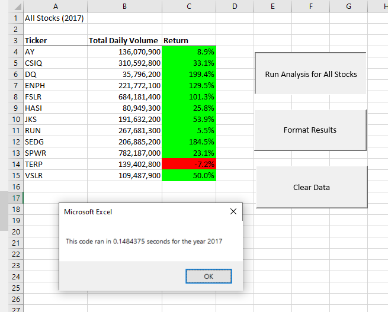

# Analysis of Stock Returns
## Project Overview
Steve's parents are interested in investing in stocks and Steve has asked us to put together an analysis of stock performances to ensure they are able to receive a return on their investment. We have been tasked with creating an easy to use workbook for Steve that will allow him to evalueate how well selected stocks performed in 2017 and 2018.
## Results
We were able to create a table that displays stock performance data with buttons to run calculations over a number of stocks. By adding formatting options to the results, we are able to see clearly which stocks had better performances over the years 2017 and 2018. 

![Time Elapsed for 2017]

However, our original code was set to only analyze a preset list of stocks, so we were able to refactor the code to run more efficiantely so that more stock options might be assessed in the future.

