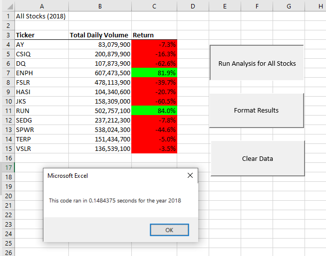

# Analysis of Stock Returns
## Project Overview
Steve's parents are interested in investing in stocks and Steve has asked us to put together an analysis of stock performances to ensure they are able to receive a return on their investment. We have been tasked with creating an easy-to-use workbook for Steve that will allow him to evaluate how well selected stocks performed in 2017 and 2018.
## Results
We were able to create a table that displays stock performance data with buttons to run calculations over a selected number of stocks. By adding formatting options to the results, we can see clearly which stocks had better performances over the years 2017 and 2018. 
However, our original code was set to only analyze a preset list of stocks, so we were able to refactor the code to run more efficiently so that more stock options might be assessed in the future.

Based on the results from the stocks analysis, there are two stocks that seemed to have maintained growth over both 2017 2018. Therefore, we recommend to Steve that his parents invest in either the stocks with tickers ENPF or RUN.

### Summary
By refactoring our code, we were able to cut down on runtime by an average of .67 seconds, which in turn allows for less RAM usage. While this may seem insignificant for our current purposes of evaluating a handful of stocks, applied to hundreds, or even thousands, of stocks and the refactored code could be invaluable in saving time and resources on a greater scale. 
One minor disadvantage to having to refactor code is the time and effort it takes to ensure a more efficient code works properly. We would want to ensure the time and RAM saved per analysis would be worth the labor it took to refactor the code. 

